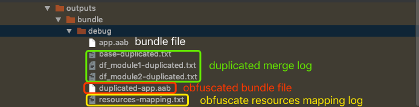

**[English](OUTPUT.md)** | [简体中文](../zh-cn/OUTPUT.md)
# Output file

>The obfuscated file output directory is identical to the file directory output by the bundle package, both under the `build/outputs/bundle/{flavor}/` directory.

The obfuscated output file is shown below:



## resources-mapping
A log file for recording resource obfuscation rules, the example is shown below:

```txt
res dir mapping:
	res/color-v21 -> res/c
	res/color-v23 -> res/d
	res/anim -> res/a

res id mapping:
	0x7f0c00ba : com.bytedance.android.app.R.style.RtlUnderlay.Widget.AppCompat.ActionButton.Overflow -> com.bytedance.android.app.R.style.eb
	0x7f040002 : com.bytedance.android.app.R.color.abc_btn_colored_borderless_text_material -> com.bytedance.android.app.R.color.c
	0x7f0c00d5 : com.bytedance.android.app.R.style.TextAppearance.AppCompat.Title -> com.bytedance.android.app.R.style.f2
	0x7f0c0022 : com.bytedance.android.app.R.style.Base.TextAppearance.AppCompat.Small.Inverse -> com.bytedance.android.app.R.style.a8

res entries path mapping:
	0x7f060030 : base/res/drawable-xxhdpi-v4/abc_list_selector_disabled_holo_dark.9.png -> res/h/z.9.png
	0x7f060022 : base/res/drawable-xxxhdpi-v4/abc_ic_star_half_black_16dp.png -> res/k/o.png
```

- **res dir mapping：** The obfuscated rules for storing resource file directories. Format: dir -> dir (`res/` root directory can not be obfuscated)
- **res id mapping：** The obfuscated rules for storing resource names. Format: resourceId : resourceName -> resourceName (resourceId will not be read in increment obfuscating)
- **res entries path mapping：** The obfuscated rules for storing resource file paths. Format: resourceId : path -> path (resourceId will not be read in obfuscating)

## -duplicated.txt
Used to record the deduplicated resource files, the example is shown below:

```txt
res filter path mapping:
	res/drawable-hdpi-v4/abc_list_divider_mtrl_alpha.9.png -> res/drawable-mdpi-v4/abc_list_divider_mtrl_alpha.9.png (size 167B)
	res/color-v23/abc_tint_spinner.xml -> res/color-v23/abc_tint_edittext.xml (size 942B)
	res/drawable-xhdpi-v4/abc_list_divider_mtrl_alpha.9.png -> res/drawable-mdpi-v4/abc_list_divider_mtrl_alpha.9.png (size 167B)
removed: count(3), totalSize(1.2KB)
```
