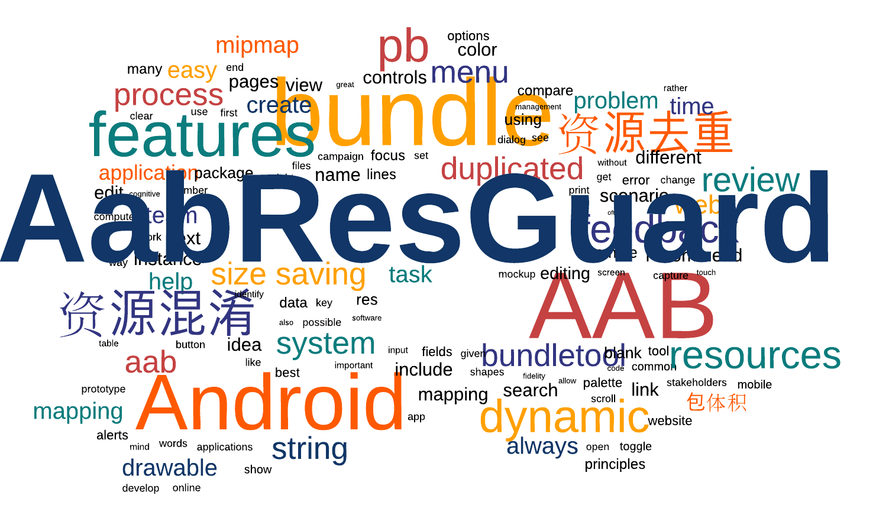

# AabResGuard
<h1 align="center">
  
  <p align="center" style="font-size: 0.3em">针对 aab 文件的资源混淆工具</p>
</h1>

[  ](https://bintray.com/yeoh/maven/aabresguard-plugin/0.1.4/link)
[](../../LICENSE)
[](https://github.com/google/bundletool)

[English](../../README.md) | **[简体中文](README.md)**

> 本工具由字节跳动抖音 Android 团队提供。

## 特性
> 针对 aab 文件的资源混淆工具

- **资源去重：** 对重复资源文件进行合并，缩减包体积。
- **文件过滤：** 支持对 `bundle` 包中的文件进行过滤，目前只支持 `MATE-INFO/`、`lib/` 路径下的过滤。
- **白名单：** 白名单中的资源，名称不予混淆。
- **增量混淆：** 输入 `mapping` 文件，支持增量混淆。
- **文案删除：** 输入按行分割的字符串文件，移除文案及翻译。
- **？？？：** 展望未来，会有更多的特性支持，欢迎提交 PR & issue。

## [数据收益](DATA.md)
**AabResGuard** 是抖音Android团队完成的资源混淆工具，目前已经在 **Tiktok、Vigo** 等多个产品上线多月，目前无相关资源问题的反馈。
具体的数据详细信息请移步 **[数据收益](DATA.md)** 。

## 快速开始
- **命令行工具：** 支持命令行一键输入输出。
- **Gradle plugin：** 支持 `gradle plugin`，使用原始打包命令执行混淆。

### Gradle plugin
在 `build.gradle(root project)` 中进行配置
```gradle
buildscript {
  repositories {
    mavenCentral()
    jcenter()
    google()
   }
  dependencies {
    classpath "com.bytedance.android:aabresguard-plugin:0.1.0"
  }
}
```

在 `build.gradle(application)` 中配置
```gradle
apply plugin: "com.bytedance.android.aabResGuard"
aabResGuard {
    mappingFile = file("mapping.txt").toPath() // 用于增量混淆的 mapping 文件
    whiteList = [ // 白名单规则
        "*.R.raw.*",
        "*.R.drawable.icon"
    ]
    obfuscatedBundleFileName = "duplicated-app.aab" // 混淆后的文件名称，必须以 `.aab` 结尾
    mergeDuplicatedRes = true // 是否允许去除重复资源
    enableFilterFiles = true // 是否允许过滤文件
    filterList = [ // 文件过滤规则
        "*/arm64-v8a/*",
        "META-INF/*"
    ]
    enableFilterStrings = false // 过滤文案
    unusedStringPath = file("unused.txt").toPath() // 过滤文案列表路径 默认在mapping同目录查找
    languageWhiteList = ["en", "zh"] // 保留en,en-xx,zh,zh-xx等语言，其余均删除
}
```

`aabResGuard plugin` 侵入了 `bundle` 打包流程，可以直接执行原始打包命令进行混淆。
```cmd
./gradlew clean :app:bundleDebug --stacktrace
```

通过 `gradle` 获取混淆后的 `bundle` 文件路径
```groovy
def aabResGuardPlugin = project.tasks.getByName("aabresguard${VARIANT_NAME}")
Path bundlePath = aabResGuardPlugin.getObfuscatedBundlePath()
```

### [白名单](../en/WHITELIST.md)
不需要混淆的资源. 如果[白名单](../en/WHITELIST.md)中没有包含你的配置，欢迎提交 PR.

### [命令行支持](COMMAND.md)
**AabResGuard** 提供了 `jar` 包，可以使用命令行直接执行，具体的使用请移步 **[命令行支持](COMMAND.md)** 。

### [输出文件](OUTPUT.md)
在打包完成后会输出混淆后的文件和相应的日志文件，详细信息请移步 **[输出文件](OUTPUT.md)** 。
- **resources-mapping.txt：** 资源混淆 mapping，可作为下次混淆输入以达到增量混淆的目的。
- **aab：** 优化后的 aab 文件。
- **-duplicated.txt：** 被去重的文件日志记录。

## [版本日志](CHANGELOG.md)
版本变化日志记录，详细信息请移步 **[版本日志](CHANGELOG.md)** 。

## [代码贡献](CONTRIBUTOR.md)
阅读详细内容，了解如何参与改进 **AabResGuard**。

### 贡献者
* [JingYeoh](https://github.com/JingYeoh)
* [Jun Li]()
* [Zilai Jiang](https://github.com/Zzzia)
* [Zhiqian Yang](https://github.com/yangzhiqian)
* [Xiaoshuang Bai (Designer)](https://www.behance.net/shawnpai)

## 感谢
* [AndResGuard](https://github.com/shwenzhang/AndResGuard/)
* [BundleTool](https://github.com/google/bundletool)
